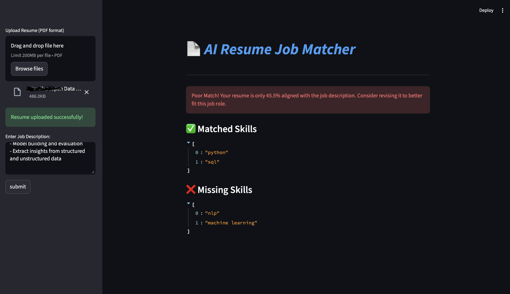

# 📄 AI Resume–Job Matching & Skill Gap Analyzer

An NLP-powered application that evaluates semantic similarity between resumes and job descriptions using transformer embeddings and provides explainable skill gap analysis.

---

<p align="centre">

</p>

---


##  Project Overview

Manual resume screening is time-consuming and inconsistent.  
This project leverages a pre-trained Sentence-BERT model to compute semantic similarity between a candidate's resume and a job description, generating a match score and identifying missing skills.

The system supports PDF resume uploads and provides interpretable results through an interactive Streamlit interface.

---

## Key Features

- Semantic similarity scoring using Sentence-BERT
- PDF resume upload and text extraction
- Text preprocessing pipeline
- Skill extraction and gap analysis
- Match score categorization (Excellent / Good / Low)
- Improvement suggestions based on missing skills
- Interactive Streamlit UI

---

## System Architecture
```
                    ┌──────────────────────────┐
                    │        User (UI)         │
                    │  Upload Resume (PDF)     │
                    │  Paste Job Description   │
                    └─────────────--───────────┘
                                 |
                                 ▼
                    ┌──────────────────────────┐
                    │      Streamlit App       │
                    │        (app.py)          │
                    └──────────────┬───────────┘
                                   │
                                   ▼
                    ┌──────────────────────────┐
                    │   PDF Text Extraction    │
                    │      (pdfplumber)        │
                    └──────────────┬───────────┘
                                   │
                                   ▼
                    ┌──────────────────────────┐
                    │  Text Preprocessing      │
                    │   (preprocess.py)        │
                    │  - Lowercasing           │
                    │  - Remove special chars  │
                    │  - Normalize whitespace  │
                    └──────────────┬───────────┘
                                   │
                                   ▼
                    ┌──────────────────────────┐
                    │   Embedding Generation   │
                    │   (model.py)             │
                    │   all-MiniLM-L6-v2       │
                    └──────────────┬───────────┘
                                   │
                                   ▼
                    ┌──────────────────────────┐
                    │   Cosine Similarity      │
                    │   (scikit-learn)         │
                    └──────────────┬───────────┘
                                   │
                                   ▼
                    ┌──────────────────────────┐
                    │     Similarity Score     │
                    │     (0.00 – 1.00)        │
                    └──────────────────────────┘


```

---

##  Tech Stack

- Python
- Sentence-Transformers (all-MiniLM-L6-v2)
- PyTorch
- Scikit-learn
- Streamlit
- pdfplumber
- NumPy
- Pandas

---

## Project Structure

resume-job-matcher/
│
├── app.py
├── requirements.txt
├── README.md
│
├── data/
│ ├── sample_resumes/
│ └── sample_jds/
│
├── src/
│ ├── preprocessing.py
│ ├── embeddings.py
│ ├── scorer.py
│ ├── skill_extractor.py


---

##  Model Details

This project uses the pre-trained `all-MiniLM-L6-v2` Sentence-BERT model to generate sentence embeddings.

- No model training was performed.
- The system performs inference only.
- Similarity is computed using cosine similarity.

### Score Interpretation

| Score Range | Interpretation  |
|-------------|-----------------|
| 0.80 – 0.90 | Excellent Match |
| 0.65 – 0.80 | Good Match      |
| 0.50 – 0.65 | Partial Match   |
| < 0.50      | Low Match       |

---

##  Data

The project uses a small set of synthetic resumes and publicly inspired job descriptions for validation purposes.

All personal information is anonymized.

The model itself is pre-trained and not fine-tuned on this dataset.

---

##  Installation

```bash
git clone <your-repo-url>
cd resume-job-matcher

python -m venv venv
source venv/bin/activate  # macOS / Linux
# venv\Scripts\activate   # Windows

pip install -r requirements.txt
```
## Run the Application

```bash
streamlit run app.py
```

## Example Output & Interpretation
*** Resume ↔ JD Similarity Score: 0.78 ***

|Score Range | Interpretation                                  |
|------------|-------------------------------------------------|
|0.80 – 1.00 | 🟢 Strong Match: Candidate is highly qualified. |
|0.60 – 0.79 | 🟡 Moderate Match: Worth a manual review.       |
|0.00 – 0.59 | 🔴 Weak Match: Skills do not align well.        |

---

## Preprocessing Steps
### To ensure cleaner embeddings and consistent scores, the text undergoes:

* Lowercasing: Standardizing all text.

* Special Character Removal: Cleaning noise and symbols.

* Tokenization Cleaning: Stripping non-alphanumeric tokens.

* Whitespace Normalization: Ensuring clean vector inputs.

----


